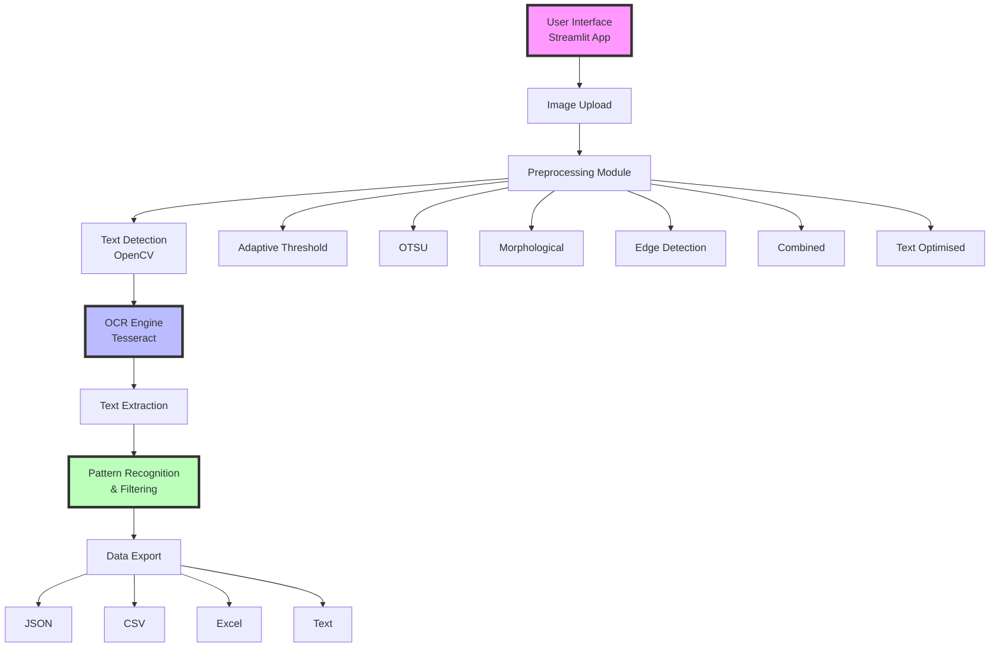
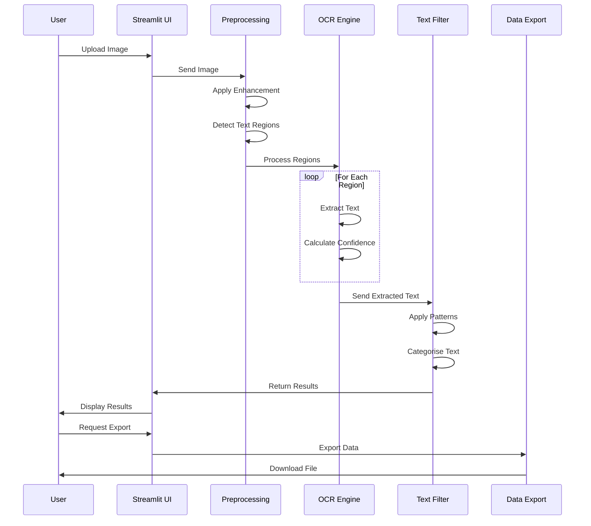
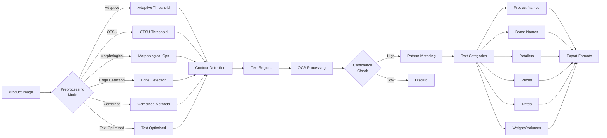
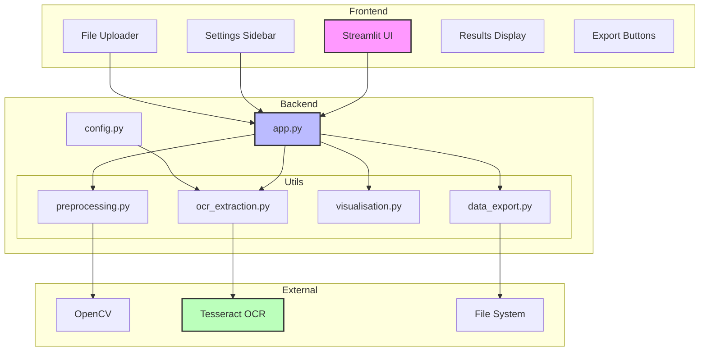
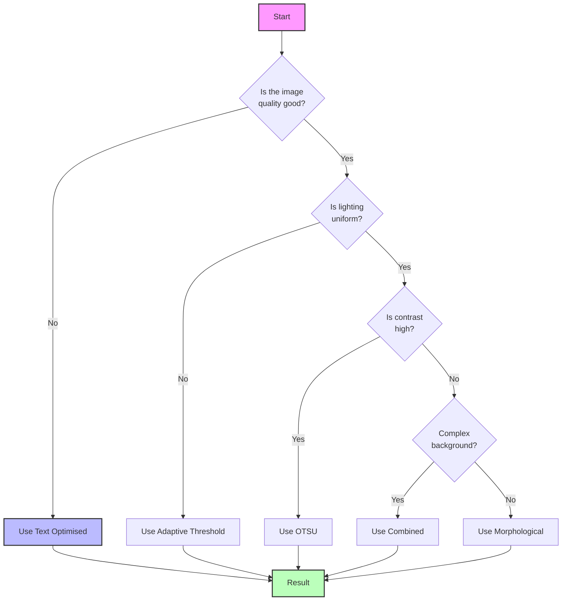
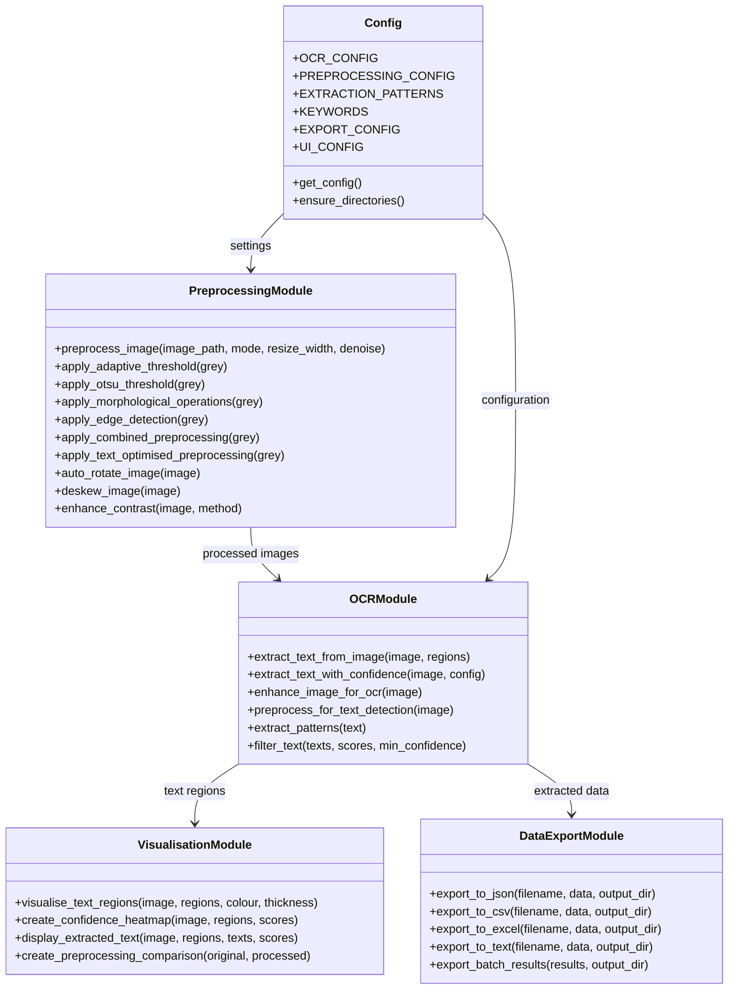
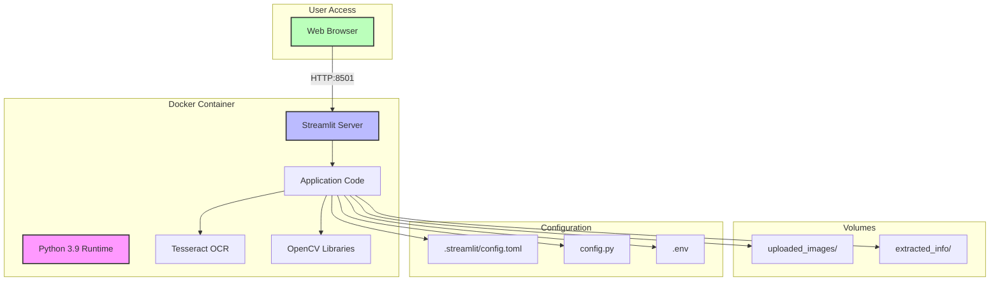

# Product Information Extractor

[](https://github.com/yourusername/Product-Information-Extractor/actions)
[](https://opensource.org/licenses/MIT)
[](https://www.python.org/downloads/)
[](https://github.com/psf/black)

## How It Works

```mermaid
graph LR
    A[Product Label Image] --> B[Upload to App]
    B --> C[Image Preprocessing]
    C --> D[Text Detection]
    D --> E[OCR Extraction]
    E --> F[Pattern Recognition]
    F --> G[Categorisation]
    G --> H[Results Display]
    H --> I[Export Data]

    style A fill:#f9f,stroke:#333,stroke-width:2px
    style E fill:#bbf,stroke:#333,stroke-width:2px
    style H fill:#bfb,stroke:#333,stroke-width:2px
```



## Quick Start

```bash
# Clone the repository
git clone https://github.com/yourusername/Product-Information-Extractor.git
cd Product-Information-Extractor

# Create and activate virtual environment
python3 -m venv venv
source venv/bin/activate  # On Windows: venv\Scripts\activate

# Install dependencies
pip install -r requirements.txt

# Verify installation
python -c "import streamlit; import cv2; import pytesseract; print('All packages installed successfully!')"

# Run the app
streamlit run app.py
```

## Overview
Product Information Extractor is a powerful Streamlit-based application that uses advanced OCR (Optical Character Recognition) technology to extract product details from images. The tool processes images, detects text regions, and intelligently categorises text into product names, retailer names, prices, dates, and other relevant information.

## System Architecture



## Processing Workflow



## Features
- **Image Upload**: Support for `.jpeg`, `.jpg`, `.png`, and `.bmp` formats
- **Advanced Text Detection**: Using OpenCV for accurate text region detection
- **Smart OCR**: Enhanced Tesseract OCR with confidence scoring
- **Pattern Recognition**: Automatic extraction of prices, dates, weights, volumes, and more
- **Intelligent Categorisation**: Identifies product names, retailers, and brands
- **Confidence Scoring**: Shows confidence levels for extracted text
- **Visual Feedback**: Displays detected text regions on images
- **Multiple Preprocessing Modes**: Various image enhancement techniques
- **Batch Processing**: Process multiple images at once
- **Multiple Export Formats**: JSON, CSV, Excel, and Text
- **Docker Support**: Easy deployment with Docker and docker-compose
- **Comprehensive Tests**: Unit tests for core functionality
- **CI/CD**: GitHub Actions workflow for continuous integration

## Data Flow



## Component Interaction



## Installation

### Prerequisites
- Python (>=3.8)
- pip
- Tesseract OCR

### Clone the Repository
```bash
git clone https://github.com/yourusername/Product-Information-Extractor.git
cd Product-Information-Extractor
```

### Set Up Python Environment

#### Option 1: Using venv (Recommended)
```bash
# Create a virtual environment
python3 -m venv venv

# Activate the virtual environment
# On macOS/Linux:
source venv/bin/activate
# On Windows:
venv\Scripts\activate

# Install dependencies
pip install -r requirements.txt
```

#### Option 2: Using conda
```bash
# Create a conda environment
conda create -n product-extractor python=3.9

# Activate the environment
conda activate product-extractor

# Install dependencies
pip install -r requirements.txt
```

#### Option 3: Using system Python
```bash
# Install dependencies directly (not recommended for production)
pip3 install -r requirements.txt
```

### Install Tesseract OCR

#### Windows
Download and install [Tesseract OCR](https://github.com/UB-Mannheim/tesseract/wiki)

#### macOS (Homebrew)
```bash
brew install tesseract
```

#### Linux (Ubuntu/Debian)
```bash
sudo apt-get update
sudo apt-get install tesseract-ocr tesseract-ocr-eng
```

## Usage

### Running the Application

1. **Ensure your virtual environment is activated** (if using one):
   ```bash
   # On macOS/Linux:
   source venv/bin/activate
   # On Windows:
   venv\Scripts\activate
   ```

2. **Run the Streamlit app**:
   ```bash
   streamlit run app.py
   ```

   Or if you have issues with the streamlit command:
   ```bash
   python -m streamlit run app.py
   ```

3. **Access the application**:
   - The app will automatically open in your default web browser
   - If not, navigate to: `http://localhost:8501`
   - You should see the Product Information Extractor interface

4. **Stop the application**:
   - Press `Ctrl+C` in the terminal
   - Deactivate the virtual environment when done:
     ```bash
     deactivate
     ```

### Docker Deployment

1. **Build and run with docker-compose**:
   ```bash
   docker-compose up --build
   ```

2. **Or build manually**:
   ```bash
   docker build -t product-info-extractor .
   docker run -p 8501:8501 -v $(pwd)/uploaded_images:/app/uploaded_images -v $(pwd)/extracted_info:/app/extracted_info product-info-extractor
   ```

3. **Access the application**:
   - Open your browser to: `http://localhost:8501`
   - The app should load automatically

4. **Check logs if you encounter issues**:
   ```bash
   docker-compose logs -f
   ```

5. **Test the container**:
   ```bash
   docker-compose exec app python test_imports.py
   ```

### Using the Application
1. Choose between **Single Image** or **Batch Processing** mode
2. Upload image(s) containing product labels
3. Select preprocessing options if needed
4. View extracted information with confidence scores
5. Export results in your preferred format

## Preprocessing Mode Selection Guide



## Project Structure
```
product-information-extractor/
├── app.py                      # Streamlit application main file
├── config.py                   # Configuration management
├── utils/
│   ├── preprocessing.py        # Image preprocessing functions
│   ├── ocr_extraction.py       # OCR and text extraction logic
│   ├── data_export.py          # Export functionality
│   └── visualisation.py        # Visualisation utilities
├── tests/
│   ├── test_preprocessing.py   # Preprocessing tests
│   └── test_ocr_extraction.py  # OCR extraction tests
├── requirements.txt            # Python dependencies
├── Dockerfile                  # Docker configuration
├── docker-compose.yml          # Docker Compose configuration
├── .pre-commit-config.yaml     # Pre-commit hooks configuration
├── .github/workflows/ci.yml    # GitHub Actions CI workflow
└── README.md                   # Project documentation
```

## Configuration

The application uses a comprehensive configuration system (`config.py`) that includes:

- **OCR Settings**: Confidence thresholds, PSM modes, language settings
- **Preprocessing Options**: Image enhancement techniques, resize settings
- **Pattern Extraction**: Regular expressions for prices, dates, weights, etc.
- **Keyword Dictionaries**: Extensive lists of products, retailers, and brands
- **Export Options**: Available formats and timestamp settings
- **UI Settings**: File size limits, allowed extensions, batch processing limits

## Development

### Setting up Development Environment
```bash
# Create virtual environment
python -m venv venv
source venv/bin/activate  # On Windows: venv\Scripts\activate

# Install dependencies
pip install -r requirements.txt

# Install pre-commit hooks
pre-commit install
```

### Running Tests
```bash
# Run all tests
pytest tests/ -v

# Run with coverage
pytest tests/ -v --cov=utils --cov-report=html
```

### Code Quality Tools
```bash
# Format code with Black
black .

# Sort imports with isort
isort .

# Run linting
flake8 . --max-line-length=88 --extend-ignore=E203,W503

# Type checking
mypy . --ignore-missing-imports
```

## Key Functions



## Deployment Architecture



## API Reference

### Main Functions

#### `preprocess_image(image_path, preprocessing_mode='adaptive_threshold')`
Preprocesses images for better OCR results. Supports multiple enhancement modes.

#### `extract_text_from_image(image, regions)`
Extracts text from detected regions with confidence scoring.

#### `filter_text(texts, confidences, min_confidence=30.0)`
Filters and categorises extracted text based on keywords and patterns.

#### `export_to_json(filename, data, output_dir)`
Exports extracted data to JSON format with timestamps.

## Contributing

Contributions are welcome! Please follow these steps:

1. Fork the repository
2. Create a new branch (`git checkout -b feature/amazing-feature`)
3. Make your changes
4. Run tests and ensure code quality
5. Commit your changes (`git commit -m 'Add amazing feature'`)
6. Push to the branch (`git push origin feature/amazing-feature`)
7. Open a Pull Request

### Development Guidelines
- Follow PEP 8 and use Black for formatting
- Add type hints to all functions
- Write tests for new features
- Update documentation as needed
- Ensure all tests pass before submitting PR

## Licence

This project is licensed under the MIT Licence - see the [LICENCE](LICENCE) file for details.

## Acknowledgements

- OpenCV community for excellent image processing tools
- Tesseract OCR for the powerful text recognition engine
- Streamlit for the intuitive web framework
- All contributors who help improve this project

## Troubleshooting

### Common Issues

1. **ModuleNotFoundError: No module named 'streamlit'**
   ```bash
   # Ensure you're in the virtual environment
   # Then reinstall dependencies
   pip install -r requirements.txt
   ```

2. **Tesseract not found error**
   ```bash
   # macOS
   brew install tesseract

   # Ubuntu/Debian
   sudo apt-get install tesseract-ocr

   # Windows
   # Download installer from: https://github.com/UB-Mannheim/tesseract/wiki
   ```

3. **ImportError: libGL.so.1: cannot open shared object file**
   ```bash
   # Linux systems
   sudo apt-get update
   sudo apt-get install libgl1-mesa-glx
   ```

4. **Port 8501 already in use**
   ```bash
   # Kill the process using the port
   lsof -ti:8501 | xargs kill -9

   # Or run on a different port
   streamlit run app.py --server.port=8502
   ```

5. **Python version issues**
   ```bash
   # Check your Python version
   python --version

   # If needed, use specific Python version
   python3.9 -m venv venv
   ```

6. **Docker: 404 Not Found error**
   ```bash
   # Check if container is running
   docker ps

   # Check container logs
   docker-compose logs -f

   # Rebuild the container
   docker-compose down
   docker-compose up --build

   # Test imports inside container
   docker-compose exec app python test_imports.py
   ```

7. **Docker: Permission denied errors**
   ```bash
   # Fix permissions on local directories
   sudo chown -R $USER:$USER uploaded_images extracted_info
   chmod 755 uploaded_images extracted_info
   ```

8. **Docker: Container won't start**
   ```bash
   # Remove old containers and volumes
   docker-compose down -v
   docker system prune -f

   # Rebuild from scratch
   docker-compose build --no-cache
   docker-compose up
   ```

### Getting Help

- Check the [Issues](https://github.com/yourusername/Product-Information-Extractor/issues) page
- Read the error messages carefully - they often contain the solution
- Ensure all prerequisites are properly installed
- Try running with Docker if you have persistent environment issues

## Contact

For questions or suggestions, reach out at [malkaisi92@gmail.com](mailto:malkaisi92@gmail.com) or open an issue in the repository.

---
Made with care by Mohamed Al-Kaisi